# GESPRO

🟠 URL GITHUB: https://github.com/ivaanesteepar/GESPRO_4
 
🟠 URL JIRA: https://ier1003.atlassian.net/jira/software/projects/GESP1/boards/2/backlog

## ✍️ Historias de usuario ✍️
### SPRINT 1
Historia de Diferentes formatos de la funda empezada el 23/11/2023
 
Historia de Diferentes formatos de la funda finalizada el 27/11/2023
  
Historia de Desarrollo de la pagina web empezada el 23/11/2023..
 
Historia de Desarrollo de pagina web finalizada el 27/11/2023
  
Historia de Tienda fisica empezada el 27/11/2023
 
Historia de Tienda fisica finalizada el 28/11/2023
  
Historia de Cesta de la compra empezada el 24/11/2023
 
Historia de Cesta de la compra finalizada el 27/11/2023
  
### SPRINT 2
Historia de Sistema de calificaciones y opiniones empezada el 07/12/2023
 
Historia de Sistema de calificaciones y opiniones finalizada el 11/12/2023
  
Historia de Logo empezada el 09/12/2023
 
Historia de Logo finalizada el 10/12/2023
  
Historia de Pantalla que muestre el diseño futuro de la funda empezada el 11/12/2023
  
Historia de Diferentes diseños de color empezada el 11/12/2023
 
Historia de Diferentes diseños de color finalizada el 24/12/2023
 

## 👣 Pasos realizados hasta el momento 👣

### ✏ Backlog

Lo primero que hicimos fue poner en común nuestras ideas de proyecto y realizar una votación, siendo 1 la peor idea y 3 la mejor.
De esta votación salió como ganadora la idea de venta de fundas personalizadas de ordenador.

    

 
Después, definimos una serie de funcionalidades para el proyecto ganador para luego elegir las 15 mejores mediante una votación (las funcionalidades con estrella fueron las elegidas finalmente).

    

 
Creamos esas hisotrias de usuario elegidas en la votación previa.

    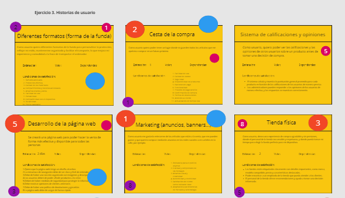

 

    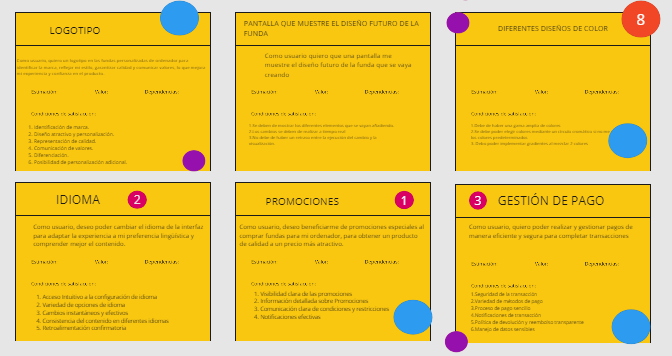

 
Una vez hechas las historias de usuario en miro, en jira creamos 4 de esas historias para completar el primer sprint.
Por defecto están en estado "por hacer".

    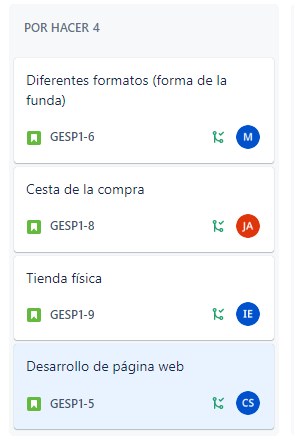

 
Poco a poco vamos poniendo las historias en curso.
 

    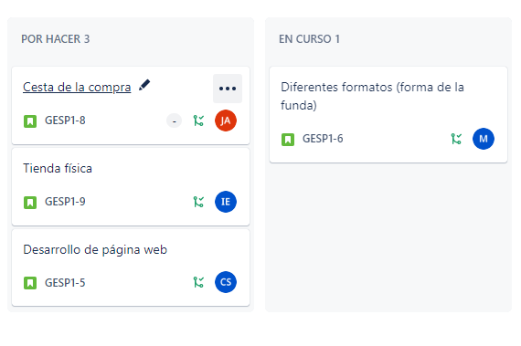

    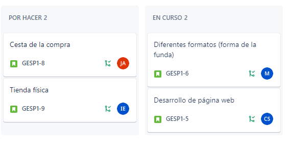

    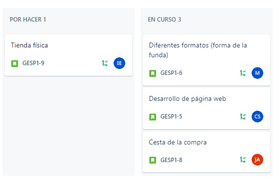

    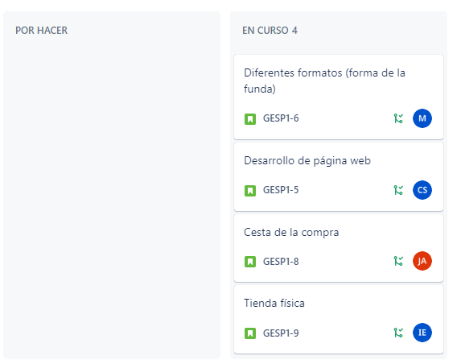

 
Una vez llegado a la fecha de finalización decidida por nosotros, se terminan.
 

    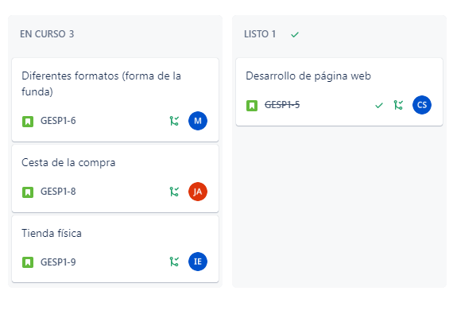

    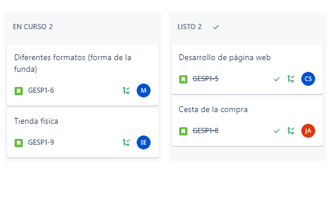

    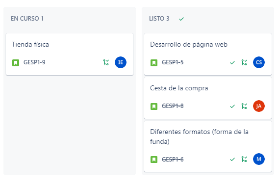

    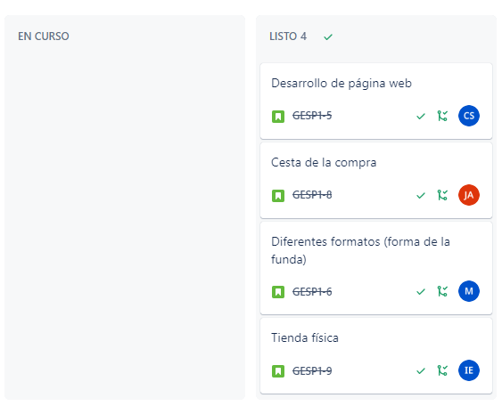

Capturas del sprint 2:

    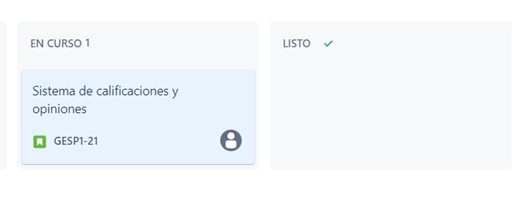

    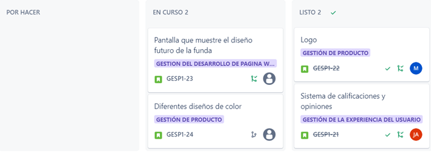

    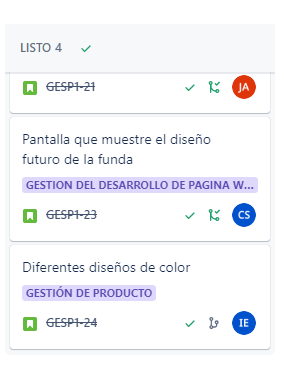

El proceso de poner en curso y finalizar las historias de usuario lo representamos creando cada uno una rama y
añadiendo en su readme cuándo se pone en curso y cuándo se finaliza la historia, haciendo merge con la rama desarrollo
para que se reúnan las modificaciones de cada uno.

### ✏ Cronograma

Creamos los epics acorde a todas las historias de usuario definidas en miro.

    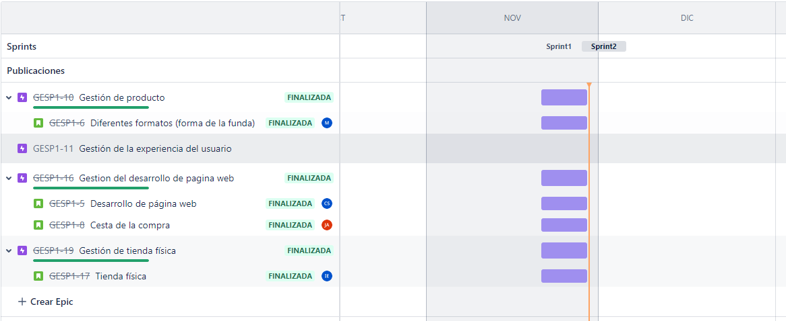

### ✏ Informe del trabajo

Gráfico resumen del primer sprint. Cada historia de usuario se completó en el tiempo indicado.

    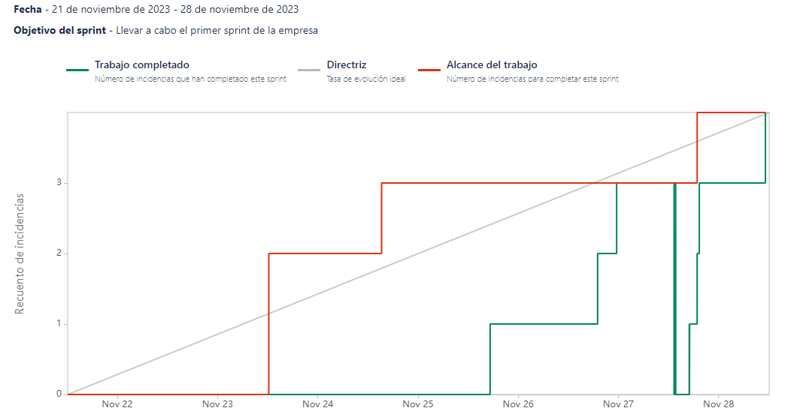

## Cuestiones ❔  

### ❓ **¿Qué es el proyecto?**  

El proyecto consiste en la venta de fundas de ordenador, ofreciendo una variedad de opciones para diferentes tamaños y modelos de ordenador. Las fundas están diseñadas para proporcionar protección contra golpes, arañazos y elementos externos, manteniendo los dispositivos electrónicos seguros y en óptimas condiciones

### ❓ **¿Por qué el proyecto es útil?**  

El proyecto es útil porque brinda una solución práctica y efectiva para proteger los ordenadores portátiles de posibles daños. Las fundas no solo ofrecen seguridad física, sino que también pueden tener diseños atractivos y personalizados, brindando a los usuarios la oportunidad de expresar su estilo mientras protegen sus dispositivos.

### ❓ **¿Como pueden comenzar los usuarios con el proyecto?**  

Los usuarios pueden comenzar explorando la variedad de fundas de ordenador disponibles en el proyecto, seleccionando la opción que mejor se adapte a sus necesidades de protección y estilo. La compra se realiza de manera sencilla a través del sitio web, con opciones de personalización si se desea. Una vez adquirida, la funda será enviada a la dirección especificada, permitiendo a los usuarios proteger sus ordenadores portátiles de manera efectiva y con un toque personalizado.

### ❓ **¿Donde pueden recibir ayuda los usuarios con tu proyecto?**  

Los usuarios pueden recibir ayuda con el proyecto a través de recursos en línea, como una sección de preguntas frecuentes en el sitio web, por el correo electrónico para consultas específicas. Además, se puede proporcionar un servicio de atención al cliente mediante chat en vivo en el sitio web, asegurando diversas opciones para abordar sus necesidades y preguntas.

### ❓ **¿Quién mantiene y contribuye con el proyecto?**  

El equipo es mantenido por nuestro equipo que incluye diseñador, desarrollador web, profesional de atención al cliente y marketing. Cada miembro desempeña un papel vital: los diseñadores crean fundas funcionales y atractivas, los desarrolladores mantienen el sitio web, el equipo de atención al cliente asiste a los usuarios y el equipo de marketing promociona el proyecto. La colaboración efectiva de estos garantiza el éxito continuo del proyecto.
